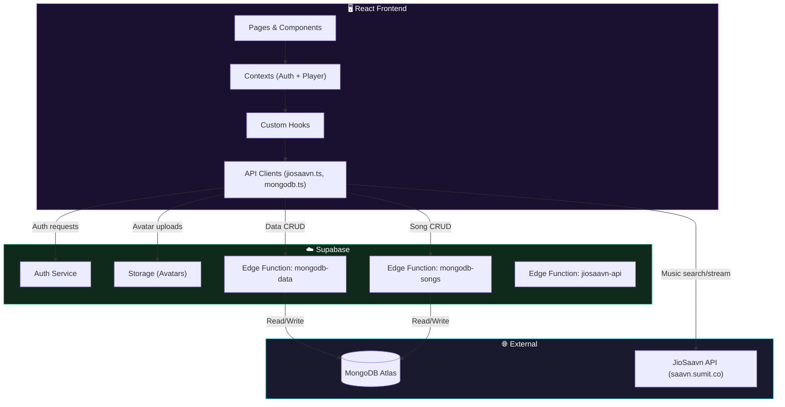
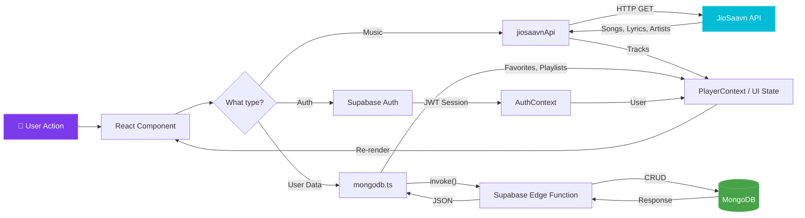
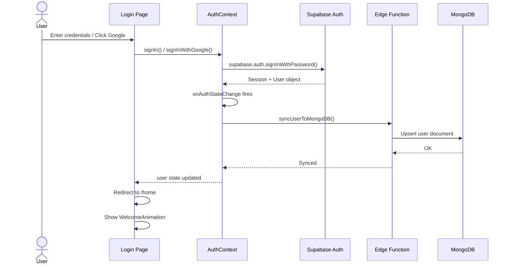
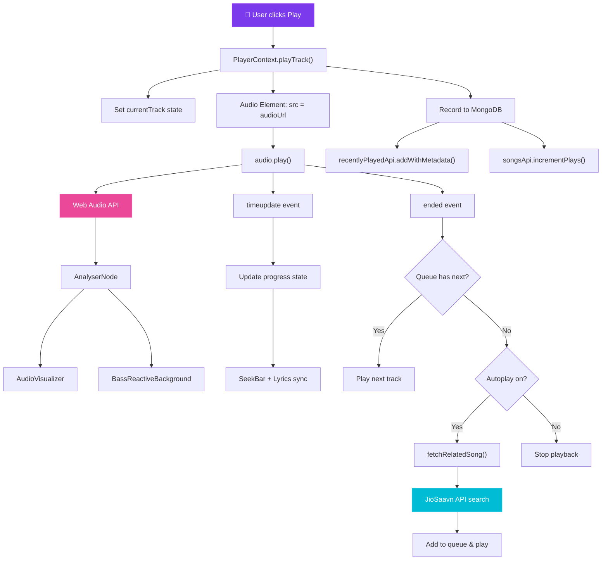

# 🎵 Raang Beat — AI-Powered Music Streaming Platform

> **Experience music with intelligence.** A premium, futuristic music streaming web application built with React, TypeScript, and AI-driven recommendations.


---

## 📋 Table of Contents

- [Features](#-features)
- [Tech Stack](#-tech-stack)
- [Architecture Diagrams](#-architecture-diagrams)
- [Folder Structure](#-folder-structure)
- [Pages](#-pages)
- [Components](#-components)
- [API Reference](#-api-reference)
- [Contexts & State Management](#-contexts--state-management)
- [Custom Hooks](#-custom-hooks)
- [Visual Effects & Animations](#-visual-effects--animations)
- [Performance Optimizations](#-performance-optimizations)
- [Environment Variables](#-environment-variables)
- [Setup & Installation](#-setup--installation)
- [Build & Deployment](#-build--deployment)

---

## ✨ Features

### 🎶 Core Music
- **Full music streaming** with play, pause, skip, seek, volume control
- **Queue management** — add, remove, reorder songs
- **Shuffle & Repeat** modes (none / repeat one / repeat all)
- **Autoplay** — automatically plays related songs when the queue ends (Spotify-style)
- **Sleep timer** — automatically stops playback after set duration
- **Synced lyrics** with click-to-seek on timestamped lines
- **Equalizer modal** with preset audio profiles

### 🤖 AI & Smart Features
- **AI Recommendations** — mood-aware song suggestions based on currently playing track
- **Mood detection** — automatic mood classification (romantic, party, chill, devotional, workout)
- **Mood backgrounds** — dynamic animated backgrounds per mood

### 📚 Library & Organization
- **Favorites** — heart/un-heart any song, persisted to MongoDB
- **Playlists** — create, edit, delete playlists with full song metadata
- **Recently played** — automatic play history tracking
- **Follow artists** — follow/unfollow artists with a dedicated Artists page

### 🎨 Premium UI/UX
- **Fullscreen player** with vinyl-spin album art, floating orbs, particle rings
- **Welcome animation** on login (confetti + celebration)
- **Bass-reactive background** pulsing with the music
- **Mouse glow** cursor effects
- **Glassmorphism** cards and neon-glow buttons
- **Dark futuristic theme** with cyan/magenta/purple gradients

### 👤 User Management
- **Email/password auth** with Supabase
- **Google OAuth** login
- **Profile management** — display name, bio, avatar upload
- **Admin dashboard** — manage songs, artists, users, site settings
- **Password reset** flow with email link

---

## 🛠 Tech Stack

| Layer | Technology | Purpose |
|---|---|---|
| **Framework** | React 18 + TypeScript | UI components & type safety |
| **Build Tool** | Vite 5 (SWC) | Fast dev server & production builds |
| **Styling** | Tailwind CSS 3 | Utility-first CSS |
| **Animations** | Framer Motion | Page transitions & micro-animations |
| **Auth & Storage** | Supabase | Authentication, file storage (avatars) |
| **Database** | MongoDB | Songs, playlists, favorites, profiles, follows |
| **DB Proxy** | Supabase Edge Functions (Deno) | Serverless MongoDB access |
| **Music API** | JioSaavn API (`saavn.sumit.co`) | Song search, streaming, lyrics, trending |
| **UI Components** | Radix UI + Shadcn/ui | Accessible, unstyled primitives |
| **Icons** | Lucide React | Consistent icon system |
| **State** | React Context | Auth state, player state |
| **Data Fetching** | TanStack React Query | Server state management |
| **Routing** | React Router DOM v6 | Client-side navigation |
| **Forms** | React Hook Form + Zod | Form validation |
| **Charts** | Recharts | Admin dashboard visualizations |
| **Toasts** | Sonner | Notification system |

---

## 🏗 Architecture Diagrams

### 1. System Architecture



### 2. Data Flow



### 3. Authentication Flow



### 4. Music Playback Flow



---

## 📁 Folder Structure

```
raang-beat/
├── public/                      # Static assets
├── supabase/
│   ├── config.toml              # Supabase project config
│   ├── functions/
│   │   ├── _shared/             # Shared utilities for edge functions
│   │   ├── jiosaavn-api/        # JioSaavn API proxy edge function
│   │   ├── mongodb-data/        # MongoDB data operations edge function
│   │   └── mongodb-songs/       # MongoDB songs operations edge function
│   └── migrations/              # Database migrations
├── src/
│   ├── main.tsx                 # React entry point
│   ├── App.tsx                  # Root component with routing
│   ├── index.css                # Global styles, design system, animations
│   ├── vite-env.d.ts            # Vite type declarations
│   ├── contexts/
│   │   ├── AuthContext.tsx       # Authentication state & methods
│   │   └── PlayerContext.tsx     # Music player state & controls
│   ├── hooks/
│   │   ├── useMongoFavorites.ts  # Favorites CRUD with optimistic updates
│   │   ├── useMongoPlaylists.ts  # Playlist management
│   │   ├── useMongoRecentlyPlayed.ts  # Recently played history
│   │   ├── useMongoSongs.ts     # Song data fetching
│   │   ├── useAdmin.ts          # Admin role check
│   │   ├── useAudioAnalyzer.ts  # Web Audio API analyzer
│   │   ├── use-mobile.tsx       # Mobile viewport detection
│   │   └── use-toast.ts         # Toast notification control
│   ├── lib/
│   │   ├── jiosaavn.ts          # JioSaavn API client (12 functions)
│   │   ├── mongodb.ts           # MongoDB API client (8 API groups)
│   │   ├── musicUtils.ts        # Deduplication, shuffle, helpers
│   │   └── utils.ts             # Tailwind CN utility
│   ├── integrations/
│   │   └── supabase/
│   │       └── client.ts        # Supabase client initialization
│   ├── pages/                   # 15 page components
│   │   ├── Landing.tsx          # Public landing page
│   │   ├── Login.tsx            # Email + Google login
│   │   ├── Signup.tsx           # Registration with email verification
│   │   ├── ForgotPassword.tsx   # Password reset request
│   │   ├── ResetPassword.tsx    # New password form
│   │   ├── Home.tsx             # Main dashboard (hero, trending, AI)
│   │   ├── Library.tsx          # Songs, albums, playlists, favorites
│   │   ├── Discover.tsx         # Mood-based music discovery
│   │   ├── Artists.tsx          # Browse & search artists
│   │   ├── ArtistProfile.tsx    # Artist detail page with songs
│   │   ├── AlbumDetails.tsx     # Album detail page with tracks
│   │   ├── Profile.tsx          # User profile (avatar, bio, stats)
│   │   ├── Admin.tsx            # Admin dashboard
│   │   ├── Index.tsx            # Redirect handler
│   │   └── NotFound.tsx         # 404 page
│   └── components/
│       ├── NavLink.tsx          # Active navigation link
│       ├── ai/
│       │   └── AIRecommendations.tsx  # AI-powered song suggestions
│       ├── effects/
│       │   ├── AudioVisualizer.tsx     # Frequency bar visualizer
│       │   ├── BassReactiveBackground.tsx  # Bass-pulse background
│       │   ├── MoodBackground.tsx     # Per-mood animated background
│       │   ├── MouseGlow.tsx          # Cursor glow effect
│       │   ├── ParticleBackground.tsx # Floating particle effect
│       │   ├── ThrowAnimation.tsx     # Song throw transition
│       │   └── WelcomeAnimation.tsx   # Login celebration
│       ├── home/
│       │   └── TrendingSection.tsx    # Trending songs carousel
│       ├── layout/
│       │   ├── MainLayout.tsx         # Sidebar + content wrapper
│       │   ├── AppSidebar.tsx         # Navigation sidebar
│       │   ├── FloatingProfileButton.tsx  # Profile quick-access
│       │   └── Navbar.tsx             # Top navigation bar
│       ├── player/
│       │   ├── MusicPlayer.tsx        # Bottom bar player
│       │   ├── FullscreenPlayer.tsx   # Fullscreen player with lyrics
│       │   ├── LyricsModal.tsx        # Lyrics overlay modal
│       │   ├── QueueModal.tsx         # Queue management modal
│       │   ├── EqualizerModal.tsx     # Audio equalizer
│       │   ├── SeekBar.tsx            # Progress seek bar
│       │   ├── VolumeBar.tsx          # Volume slider
│       │   └── SleepTimerModal.tsx    # Sleep timer UI
│       ├── playlist/
│       │   └── AddToPlaylistModal.tsx # Add song to playlist dialog
│       ├── search/
│       │   └── SearchModal.tsx        # Global search overlay
│       └── ui/                        # 30 Shadcn/ui components
│           ├── AnimatedActionButton.tsx
│           ├── AnimatedInput.tsx
│           ├── GlassCard.tsx
│           ├── NeonButton.tsx
│           ├── ThemeToggle.tsx
│           ├── avatar.tsx
│           ├── badge.tsx
│           ├── button.tsx
│           ├── card.tsx
│           ├── dialog.tsx
│           ├── dropdown-menu.tsx
│           ├── input.tsx
│           ├── label.tsx
│           ├── scroll-area.tsx
│           ├── select.tsx
│           ├── separator.tsx
│           ├── sheet.tsx
│           ├── sidebar.tsx
│           ├── skeleton.tsx
│           ├── slider.tsx
│           ├── sonner.tsx
│           ├── switch.tsx
│           ├── tabs.tsx
│           ├── textarea.tsx
│           ├── toast.tsx
│           ├── toaster.tsx
│           ├── toggle-group.tsx
│           ├── toggle.tsx
│           ├── tooltip.tsx
│           └── use-toast.ts
├── package.json
├── tailwind.config.ts
├── vite.config.ts
├── tsconfig.json
├── tsconfig.app.json
├── tsconfig.node.json
├── postcss.config.js
├── eslint.config.js
└── index.html
```

---

## 📄 Pages

| Route | Page | Description |
|---|---|---|
| `/` | Landing | Public marketing page with features overview |
| `/login` | Login | Email/password + Google OAuth login |
| `/signup` | Signup | User registration with email verification |
| `/forgot-password` | ForgotPassword | Request password reset via email |
| `/reset-password` | ResetPassword | Set new password |
| `/home` | Home | Main dashboard — hero player, trending songs, AI recommendations, mood indicator |
| `/library` | Library | Tabs: All Songs, Albums, Playlists, Favorites with search |
| `/discover` | Discover | Mood-based music discovery (romantic, chill, party, devotional, workout) |
| `/artists` | Artists | Browse, search, and follow artists |
| `/artist/:id` | ArtistProfile | Artist detail — bio, top songs, albums, similar artists, follow button |
| `/album/:id` | AlbumDetails | Album detail — tracklist, play all, add to playlist |
| `/profile` | Profile | User profile — avatar upload, display name, bio, stats, about us |
| `/admin` | Admin | Admin panel — manage songs, artists, users, site settings (admin-only) |
| `*` | NotFound | 404 page |

---

## 🧩 Components

### AI (`src/components/ai/`)
| Component | Description |
|---|---|
| `AIRecommendations` | Generates mood-aware song recommendations based on the currently playing track |

### Effects (`src/components/effects/`)
| Component | Description |
|---|---|
| `AudioVisualizer` | Frequency bar visualizer using Web Audio API AnalyserNode |
| `BassReactiveBackground` | Background that pulses with bass frequencies |
| `MoodBackground` | Animated background that changes color/style per mood |
| `MouseGlow` | Subtle glow effect following the cursor |
| `ParticleBackground` | Floating particle animation |
| `ThrowAnimation` | Song throw transition when playing a new track |
| `WelcomeAnimation` | Confetti celebration shown on first login per session |

### Home (`src/components/home/`)
| Component | Description |
|---|---|
| `TrendingSection` | Trending songs carousel with progressive loading |

### Layout (`src/components/layout/`)
| Component | Description |
|---|---|
| `MainLayout` | Root layout wrapper — sidebar + mood background + content area |
| `AppSidebar` | Navigation sidebar with links to Home, Library, Discover, Artists |
| `FloatingProfileButton` | Quick-access profile button (visible when sidebar collapsed) |
| `Navbar` | Top navigation bar |

### Player (`src/components/player/`)
| Component | Description |
|---|---|
| `MusicPlayer` | Bottom bar player — always visible when logged in |
| `FullscreenPlayer` | Immersive player — vinyl art, lyrics, floating orbs, particle ring |
| `LyricsModal` | Lyrics overlay with synced highlighting and click-to-seek |
| `QueueModal` | Queue view — now playing, next up, remove/reorder songs |
| `EqualizerModal` | Audio equalizer with preset profiles |
| `SeekBar` | Progress bar with seek-on-click |
| `VolumeBar` | Volume slider |
| `SleepTimerModal` | Set a timer to auto-stop playback |

### Playlist (`src/components/playlist/`)
| Component | Description |
|---|---|
| `AddToPlaylistModal` | Dialog to add a song to an existing or new playlist |

### Search (`src/components/search/`)
| Component | Description |
|---|---|
| `SearchModal` | Global search overlay for songs, artists, and albums |

### UI (`src/components/ui/`)
30 reusable UI primitives built with **Radix UI + Shadcn/ui**, including:
`AnimatedActionButton`, `AnimatedInput`, `GlassCard`, `NeonButton`, `ThemeToggle`, `avatar`, `badge`, `button`, `card`, `dialog`, `dropdown-menu`, `input`, `label`, `scroll-area`, `select`, `separator`, `sheet`, `sidebar`, `skeleton`, `slider`, `sonner`, `switch`, `tabs`, `textarea`, `toast`, `toaster`, `toggle-group`, `toggle`, `tooltip`

---

## 📡 API Reference

### JioSaavn API (`src/lib/jiosaavn.ts`)

Direct client for the JioSaavn music API. Base URL: `https://saavn.sumit.co`

| Function | Signature | Description |
|---|---|---|
| `searchSongs` | `(query, page?, limit?) → JioSaavnTrack[]` | Search songs by keyword |
| `searchArtists` | `(query) → JioSaavnArtist[]` | Search artists by name |
| `searchAll` | `(query) → { songs, artists }` | Combined search for songs + artists |
| `getSong` | `(songId) → JioSaavnTrack` | Get a single song by ID |
| `getArtist` | `(artistId) → JioSaavnArtist` | Get artist details |
| `getArtistSongs` | `(artistId, page?) → JioSaavnTrack[]` | Get paginated songs by artist |
| `getAlbum` | `(albumId) → { album, songs }` | Get album details with tracklist |
| `getTrending` | `(page?, limit?) → JioSaavnTrack[]` | Get trending/popular songs |
| `getNewReleases` | `(page?, limit?) → JioSaavnTrack[]` | Get newly released tracks |
| `getFeaturedAlbums` | `() → Album[]` | Get curated featured albums |
| `getSongsByMood` | `(mood, page?, limit?) → JioSaavnTrack[]` | Get songs filtered by mood |
| `getLyrics` | `(songId, title?, artist?) → { lyrics }` | Fetch synced/unsynced lyrics |

**Key Interfaces:**
```typescript
interface JioSaavnTrack {
  id: string;
  title: string;
  artist: string;
  artistId: string;
  coverUrl: string;
  audioUrl: string;
  duration: number;
  album?: string;
  year?: string;
  language?: string;
  playCount?: string;
  hasLyrics?: boolean;
  tags?: string[];
  isExternal: true;
  source: "jiosaavn";
}
```

---

### MongoDB API (`src/lib/mongodb.ts`)

All MongoDB operations go through Supabase Edge Functions (`mongodb-songs`, `mongodb-data`).

#### Songs API (`songsApi`)
| Method | Description |
|---|---|
| `getAll(limit, skip)` | Get all songs with pagination |
| `getById(songId)` | Get a single song by ID |
| `search(query, limit)` | Search songs by keyword |
| `getByMood(mood, limit)` | Get songs by mood |
| `getByArtist(artistId)` | Get songs by artist |
| `getTrending(limit)` | Get trending songs by play count |
| `getRecent(limit)` | Get recently added songs |
| `incrementPlays(songId)` | Increment play count |
| `add(data)` | Add a new song |
| `update(songId, data)` | Update song metadata |
| `delete(songId)` | Delete a song |

#### Artists API (`artistsApi`)
| Method | Description |
|---|---|
| `getAll()` | Get all artists |
| `getById(artistId)` | Get artist by ID |
| `search(query, limit)` | Search artists |
| `add(data)` | Add a new artist |
| `update(artistId, data)` | Update artist info |
| `delete(artistId)` | Delete an artist |

#### Favorites API (`favoritesApi`)
| Method | Description |
|---|---|
| `getAll(userId, limit)` | Get user's favorites |
| `getSongIds(userId)` | Get list of favorited song IDs |
| `add(userId, songId)` | Add song to favorites |
| `remove(userId, songId)` | Remove from favorites |
| `check(userId, songId)` | Check if song is favorited |
| `addExternal(userId, songId, metadata)` | Add external (JioSaavn) song to favorites with metadata |

#### Recently Played API (`recentlyPlayedApi`)
| Method | Description |
|---|---|
| `getAll(userId, limit)` | Get recently played songs |
| `add(userId, songId)` | Record a play |
| `addWithMetadata(userId, songId, metadata)` | Record play with full metadata |
| `clear(userId)` | Clear play history |

#### Playlists API (`playlistsApi`)
| Method | Description |
|---|---|
| `getAll(userId)` | Get all user playlists |
| `getById(playlistId)` | Get a single playlist |
| `create(userId, data)` | Create a new playlist |
| `update(playlistId, data)` | Update playlist info |
| `delete(playlistId)` | Delete a playlist |
| `addSong(playlistId, songId)` | Add song to playlist |
| `addSongWithMetadata(playlistId, songId, metadata)` | Add song with full metadata |
| `removeSong(playlistId, songId)` | Remove song from playlist |

#### Profiles API (`profilesApi`)
| Method | Description |
|---|---|
| `get(userId)` | Get user profile |
| `upsert(userId, data)` | Create or update profile |
| `getStats(userId)` | Get user statistics |

#### Follows API (`followsApi`)
| Method | Description |
|---|---|
| `getAll(userId)` | Get all followed artists |
| `follow(userId, artistId)` | Follow an artist |
| `unfollow(userId, artistId)` | Unfollow an artist |
| `check(userId, artistId)` | Check if following an artist |

#### Site Settings API (`siteSettingsApi`)
| Method | Description |
|---|---|
| `getAboutUs()` | Get about us content |
| `updateAboutUs(data)` | Update about us content |

---

### Supabase Services

| Service | Usage |
|---|---|
| **Auth** | Email/password signup, Google OAuth, session management, password reset |
| **Storage** | Avatar uploads to `avatars` bucket |
| **Edge Functions** | `mongodb-data`, `mongodb-songs`, `jiosaavn-api` — serverless proxy functions |

---

## 🧠 Contexts & State Management

### AuthContext (`src/contexts/AuthContext.tsx`)

Manages authentication state globally.

| Property / Method | Type | Description |
|---|---|---|
| `user` | `User \| null` | Current authenticated user |
| `session` | `Session \| null` | Current Supabase session |
| `isLoading` | `boolean` | Auth state loading indicator |
| `signUp(email, password, name?)` | `Promise` | Register new user |
| `signIn(email, password)` | `Promise` | Login with credentials |
| `signInWithGoogle()` | `Promise` | Google OAuth login |
| `signOut()` | `Promise` | Log out |
| `resetPassword(email)` | `Promise` | Send password reset email |
| `updatePassword(password)` | `Promise` | Update password |

**Auto-syncs** user data to MongoDB on sign-in via `syncUserToMongoDB()`.

---

### PlayerContext (`src/contexts/PlayerContext.tsx`)

Manages all music playback state and controls.

| Property / Method | Type | Description |
|---|---|---|
| `currentTrack` | `Track \| null` | Currently playing track |
| `queue` | `Track[]` | Current play queue |
| `isPlaying` | `boolean` | Playing state |
| `progress` | `number` | Current playback position (seconds) |
| `duration` | `number` | Total track duration (seconds) |
| `volume` | `number` | Volume level (0–1) |
| `isShuffled` | `boolean` | Shuffle mode on/off |
| `repeatMode` | `"none" \| "one" \| "all"` | Repeat mode |
| `isAutoplayEnabled` | `boolean` | Autoplay toggle |
| `analyser` | `AnalyserNode \| null` | Web Audio analyser for visualizations |
| `playTrack(track)` | `void` | Play a specific track |
| `togglePlay()` | `void` | Play/pause toggle |
| `nextTrack()` | `void` | Skip to next track |
| `previousTrack()` | `void` | Go to previous track |
| `seekTo(time)` | `void` | Seek to position |
| `setVolume(volume)` | `void` | Set volume |
| `toggleShuffle()` | `void` | Toggle shuffle |
| `toggleRepeat()` | `void` | Cycle repeat modes |
| `toggleAutoplay()` | `void` | Toggle autoplay |
| `addToQueue(track)` | `void` | Add track to queue |
| `removeFromQueue(trackId)` | `void` | Remove track from queue |
| `setQueue(tracks)` | `void` | Replace entire queue |
| `setSleepTimer(minutes)` | `void` | Set sleep timer |
| `loadSongs()` | `Promise` | Load songs from MongoDB |

**Features:**
- Session restoration (remembers last played track, position, volume)
- Web Audio API integration for audio visualization
- Autoplay with `fetchRelatedSong()` — finds related songs by artist/tags
- Records plays to MongoDB automatically

---

## 🪝 Custom Hooks

| Hook | File | Description |
|---|---|---|
| `useMongoFavorites` | `useMongoFavorites.ts` | Manage user favorites with optimistic UI updates, checks, and toggles |
| `useMongoPlaylists` | `useMongoPlaylists.ts` | CRUD operations for user playlists |
| `useMongoRecentlyPlayed` | `useMongoRecentlyPlayed.ts` | Fetch and manage recently played songs |
| `useMongoSongs` | `useMongoSongs.ts` | Fetch songs from MongoDB with search/filter |
| `useAdmin` | `useAdmin.ts` | Check if current user has admin role |
| `useAudioAnalyzer` | `useAudioAnalyzer.ts` | Connect to Web Audio API AnalyserNode for visualizations |
| `use-mobile` | `use-mobile.tsx` | Detect mobile viewport (< 768px) |
| `use-toast` | `use-toast.ts` | Programmatic toast notifications |

---

## ✨ Visual Effects & Animations

| Effect | File | Description |
|---|---|---|
| **Audio Visualizer** | `AudioVisualizer.tsx` | Real-time frequency bar visualization using Web Audio API |
| **Bass Reactive Background** | `BassReactiveBackground.tsx` | Background gradient that pulses with bass frequencies |
| **Mood Background** | `MoodBackground.tsx` | Animated gradient background that changes per mood (romantic → pink, party → violet, chill → emerald, etc.) |
| **Mouse Glow** | `MouseGlow.tsx` | Subtle radial glow following cursor position |
| **Particle Background** | `ParticleBackground.tsx` | Floating animated particles with random positions and speeds |
| **Throw Animation** | `ThrowAnimation.tsx` | Transition animation when playing a new song |
| **Welcome Animation** | `WelcomeAnimation.tsx` | Confetti celebration on first login per session |

### Fullscreen Player Effects
- **Floating Orbs** — 8 animated blurred orbs with unique hues and trajectories
- **Particle Ring** — 20 particles orbiting the album art
- **Vinyl Spin** — Album art rotates like a vinyl record when playing
- **Pulsing Rings** — Concentric rings pulsing around album art
- **Lyrics Glow** — Active lyric line has animated text shadow

---

## ⚡ Performance Optimizations

### In-Memory Caching
- **Module-level caches** in `Home.tsx`, `TrendingSection.tsx`, and `Discover.tsx`
- **5-minute TTL** — cached data serves instantly, background refresh after expiry
- **Mood-specific caching** in Discover — each mood's songs cached separately

### Scroll Performance
- **Lyrics scroll** — Replaced `scrollIntoView` with manual `scrollTo` for smoother performance
- **Throttled updates** — Active lyric line only updates state when the line actually changes
- **Lightweight transitions** — Only `color` and `opacity` transitions instead of `transition-all`
- **No layout-triggering transforms** — Removed per-line `scale()` transforms

### Background & Paint
- **Solid `#08010f` fallback** on `html`, `body`, `#root` — prevents white flash on fast scroll
- **`overscroll-behavior: none`** — prevents overscroll bounce showing white
- **`will-change: scroll-position`** — hints GPU acceleration for lyrics container

---

## 🔐 Environment Variables

Create a `.env` file in the project root:

```env
VITE_SUPABASE_URL=https://your-project.supabase.co
VITE_SUPABASE_PUBLISHABLE_KEY=your-anon-key
```

| Variable | Description |
|---|---|
| `VITE_SUPABASE_URL` | Supabase project URL |
| `VITE_SUPABASE_PUBLISHABLE_KEY` | Supabase anon/public API key |

> **Note:** MongoDB connection is configured inside the Supabase Edge Functions, not in the frontend `.env`.

---

## 🚀 Setup & Installation

### Prerequisites
- **Node.js** 18+ and **npm** 9+
- **Supabase** project (free tier works)
- **MongoDB** database (MongoDB Atlas free tier works)

### Steps

```bash
# 1. Clone the repository
git clone https://github.com/your-username/raang-beat.git
cd raang-beat

# 2. Install dependencies
npm install

# 3. Configure environment variables
cp .env.example .env
# Edit .env with your Supabase credentials

# 4. Start the development server
npm run dev
```

### Supabase Setup

1. **Authentication:**
   - Enable Email/Password provider
   - Enable Google OAuth provider (optional)
   - Configure redirect URLs for your domain

2. **Storage:**
   - Create an `avatars` bucket
   - Set bucket to public access
   - Add storage policies for authenticated uploads

3. **Edge Functions:**
   - Deploy the 3 edge functions from `supabase/functions/`:
     - `mongodb-data` — General MongoDB operations
     - `mongodb-songs` — Song-specific operations
     - `jiosaavn-api` — JioSaavn API proxy
   - Set MongoDB connection string as edge function secret:
     ```bash
     supabase secrets set MONGODB_URI="mongodb+srv://..."
     ```

---

## 📦 Build & Deployment

### Build for Production

```bash
# Production build
npm run build

# Preview production build locally
npm run preview
```

Output is generated in the `dist/` directory.

### Available Scripts

| Script | Command | Description |
|---|---|---|
| `dev` | `npm run dev` | Start Vite dev server with HMR |
| `build` | `npm run build` | Production build |
| `build:dev` | `npm run build:dev` | Development build |
| `preview` | `npm run preview` | Preview production build |
| `lint` | `npm run lint` | Run ESLint |

### Deploy to Vercel

```bash
# Install Vercel CLI
npm i -g vercel

# Deploy
vercel
```

Set environment variables in Vercel dashboard:
- `VITE_SUPABASE_URL`
- `VITE_SUPABASE_PUBLISHABLE_KEY`

### Deploy to Netlify

```bash
# Install Netlify CLI
npm i -g netlify-cli

# Deploy
netlify deploy --prod --dir=dist
```

> **Important:** Add a `_redirects` file in `public/` for SPA routing:
> ```
> /*    /index.html   200
> ```

---

## 📜 License

This project is private and proprietary.

---

<p align="center">
  Built with ❤️ by the Raang Beat team
</p>
