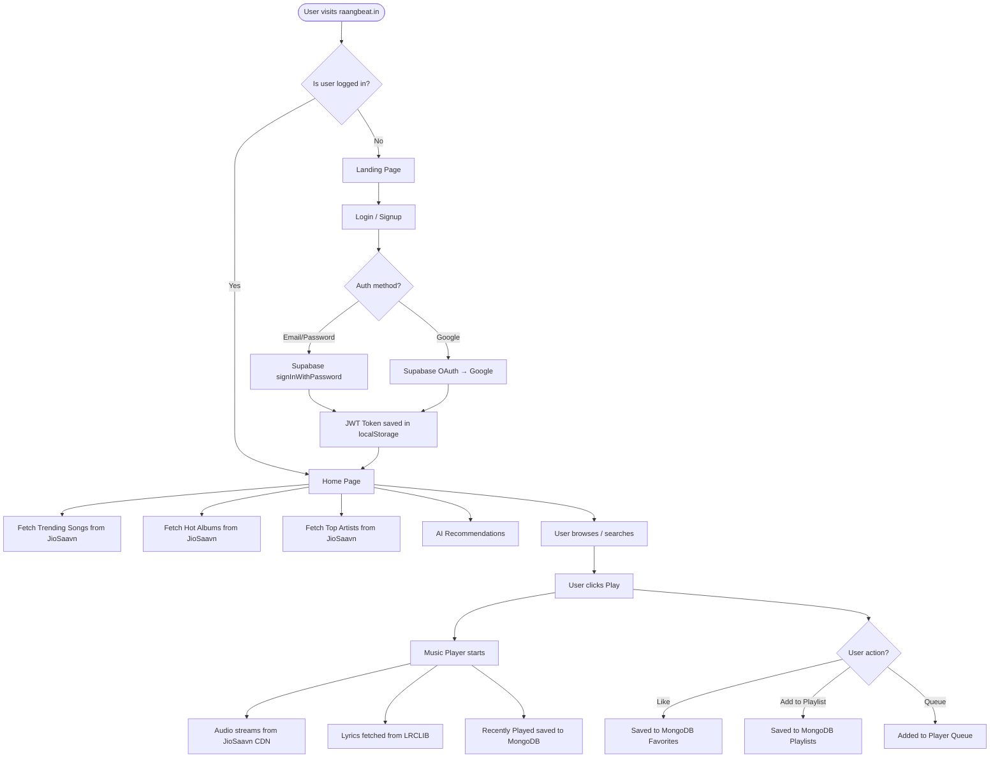
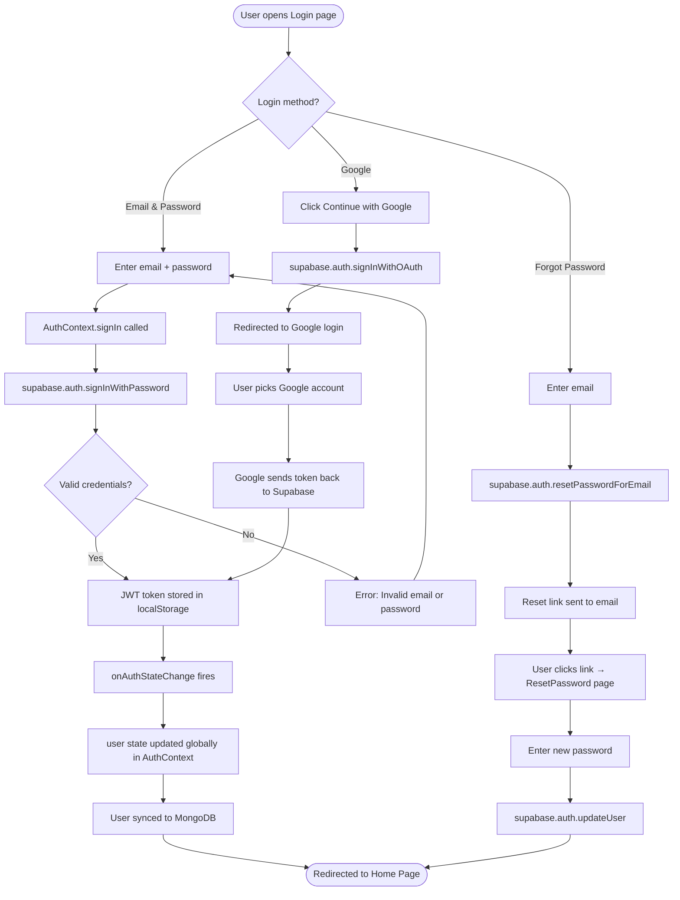
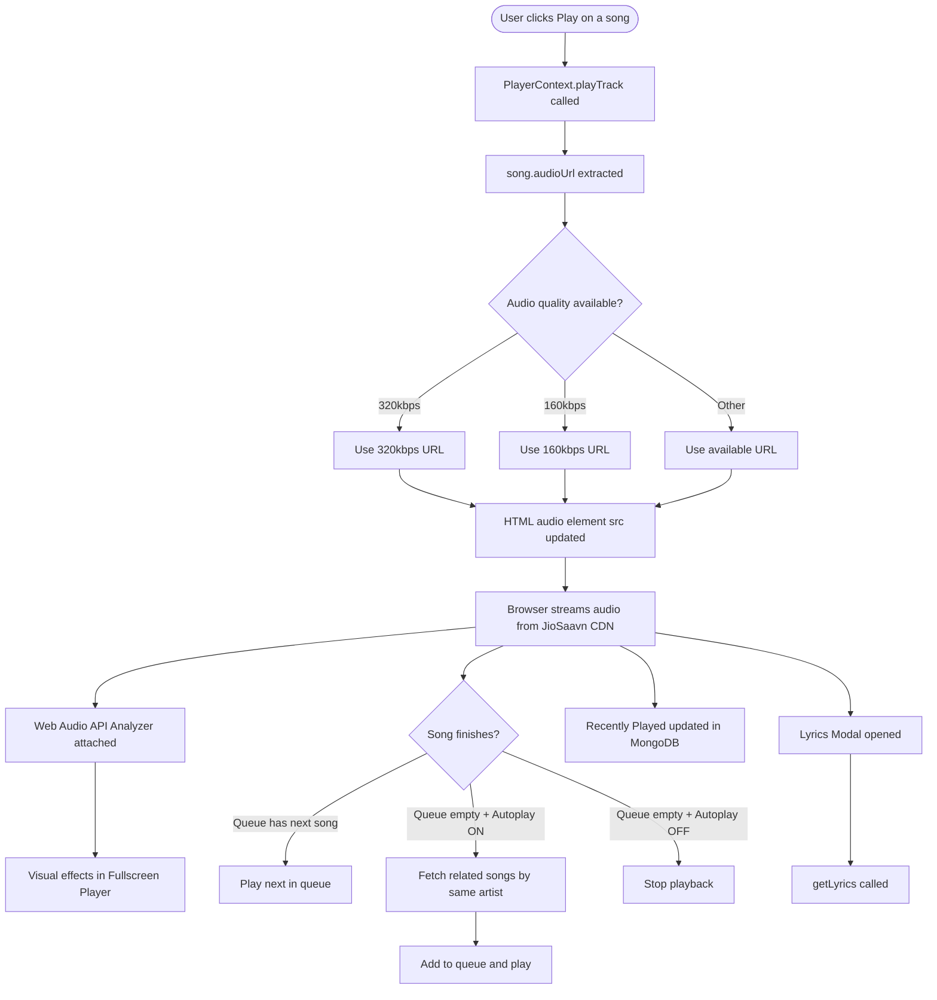
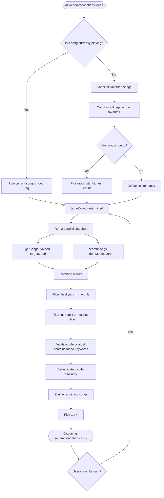
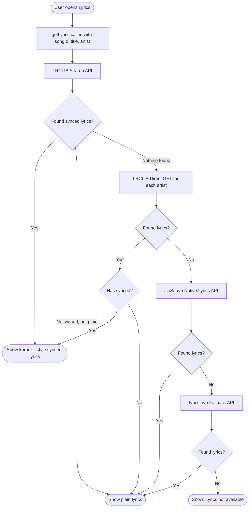
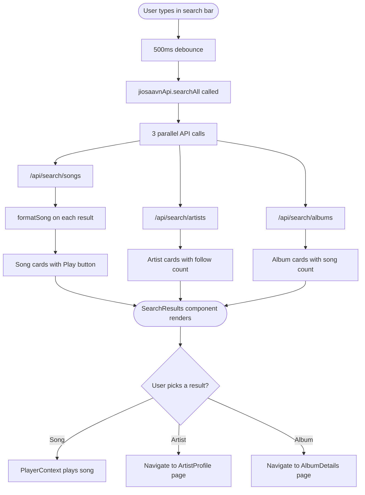
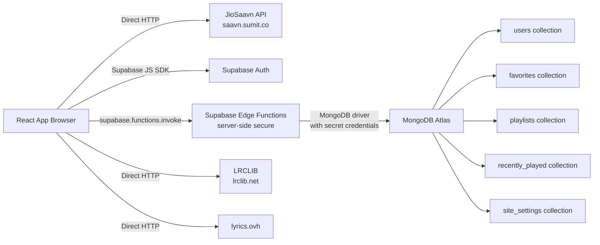

# 🎵 RangeBeat — Full Project Documentation

> A premium, full-featured music streaming web app powered by JioSaavn, with AI-based recommendations, real-time lyrics, Supabase authentication, and MongoDB data storage.

---

## 📋 Table of Contents

1. [What is RangeBeat?](#what-is-rangebeat)
2. [Tech Stack Overview](#tech-stack-overview)
3. [📊 Flowcharts](#-flowcharts)
4. [How the App Works — Big Picture](#how-the-app-works--big-picture)
5. [Project Folder Structure](#project-folder-structure)
6. [Core Library Files (`src/lib/`)](#core-library-files-srclib)
7. [Pages — Every Page Explained](#pages--every-page-explained)
8. [Contexts — Global State](#contexts--global-state)
9. [Hooks — Reusable Logic](#hooks--reusable-logic)
10. [Components — UI Building Blocks](#components--ui-building-blocks)
11. [How AI Recommendations Work](#how-ai-recommendations-work)
12. [How Music Playback Works](#how-music-playback-works)
13. [How Lyrics Work](#how-lyrics-work)
14. [How Authentication Works](#how-authentication-works)
15. [How Data Storage Works](#how-data-storage-works)
16. [How the Search Works](#how-the-search-works)
17. [Environment Variables](#environment-variables)
18. [Data Flow Diagram](#data-flow-diagram)

---

## 📊 Flowcharts

> Visual diagrams showing exactly how every major system in RangeBeat works.

---

### 1️⃣ Overall App Flow



---

### 2️⃣ Authentication Flow



---

### 3️⃣ Music Playback Flow



---

### 4️⃣ AI Recommendations Flow



---

### 5️⃣ Lyrics Fetching Flow



---

### 6️⃣ Search Flow



---

### 7️⃣ Data Storage Flow



---

## What is RangeBeat?

RangeBeat is a **full-stack music streaming web application** — similar to Spotify or JioSaavn — built entirely for the browser. Users can:

- Search and stream **millions of songs** (from JioSaavn's catalog)
- See **real-time synced lyrics** while a song plays
- Get **AI-powered song recommendations** based on their mood and listening history
- Create and manage **playlists**, mark **favorites**, view **recently played** history
- Browse **artists**, **albums**, and **trending/hot categories**
- Use an **equalizer**, **sleep timer**, **audio normalization**, and **autoplay queue**
- Admins can manage site settings, social links, and About Us content

---

## Tech Stack Overview

| Layer | Technology | Purpose |
|---|---|---|
| **Frontend** | React + Vite + TypeScript | UI framework |
| **Styling** | Tailwind CSS + shadcn/ui | Design system |
| **Animations** | Framer Motion + CSS | Page transitions, hover effects |
| **Music API** | JioSaavn (unofficial) | Songs, artists, albums, lyrics |
| **Auth** | Supabase Auth | Email/password + Google login |
| **Database** | MongoDB (via Supabase Edge Functions) | User data, playlists, favorites |
| **File Storage** | Supabase Storage | Profile pictures |
| **Lyrics** | LRCLIB + lyrics.ovh + JioSaavn | Multi-source lyrics fetching |
| **Icons** | Lucide React | UI icons |
| **Routing** | React Router DOM | Page navigation |

---

## How the App Works — Big Picture

```
User opens raangbeat.in
        │
        ▼
  Landing Page (if not logged in)
  Login / Signup via Supabase Auth
        │
        ▼
  Home Page loads
        │
        ├── Fetches Trending Songs ──────► JioSaavn API
        ├── Fetches Hot Albums ──────────► JioSaavn API
        ├── Fetches Top Artists ─────────► JioSaavn API
        │
        ▼
  User plays a song
        │
        ├── Audio streams directly from JioSaavn CDN
        ├── Lyrics fetched from LRCLIB / lyrics.ovh
        ├── Play count incremented in MongoDB
        └── Song added to Recently Played (MongoDB)

  User likes a song → saved to MongoDB Favorites
  User creates playlist → saved to MongoDB Playlists
  AI Recommendations → reads favorites + current mood → fetches from JioSaavn
```

---

## Project Folder Structure

```
src/
├── main.tsx                  # App entry point
├── App.tsx                   # Routes + global providers
├── index.css                 # Global styles, animations, themes
│
├── pages/                    # Every screen/page of the app
│   ├── Landing.tsx           # Welcome page (not logged in)
│   ├── Login.tsx             # Login form
│   ├── Signup.tsx            # Registration form
│   ├── ForgotPassword.tsx    # Password reset request
│   ├── ResetPassword.tsx     # New password form
│   ├── Home.tsx              # Main dashboard (trending, albums, AI)
│   ├── Discover.tsx          # Search & mood browsing
│   ├── Library.tsx           # Favorites + playlists + history
│   ├── Artists.tsx           # Browse all artists
│   ├── ArtistProfile.tsx     # Individual artist page
│   ├── AlbumDetails.tsx      # Album songs page
│   ├── Profile.tsx           # User profile + About Us
│   ├── Admin.tsx             # Admin panel (site settings)
│   ├── Index.tsx             # Redirect to home/landing
│   └── NotFound.tsx          # 404 page
│
├── components/
│   ├── ai/
│   │   └── AIRecommendations.tsx   # AI-powered song suggestions
│   ├── player/
│   │   ├── MusicPlayer.tsx         # Bottom player bar
│   │   ├── FullscreenPlayer.tsx    # Full-screen player view
│   │   ├── LyricsModal.tsx         # Lyrics overlay
│   │   ├── QueueModal.tsx          # Song queue manager
│   │   ├── EqualizerModal.tsx      # EQ controls
│   │   ├── SeekBar.tsx             # Progress / seek bar
│   │   ├── VolumeBar.tsx           # Volume slider
│   │   └── SleepTimerModal.tsx     # Sleep timer
│   ├── home/
│   │   └── TrendingSection.tsx     # Home page trending UI
│   ├── layout/
│   │   ├── MainLayout.tsx          # App shell (sidebar + player)
│   │   ├── Sidebar.tsx             # Left navigation
│   │   ├── Header.tsx              # Top navigation bar
│   │   └── SearchBar.tsx           # Global search input
│   ├── playlist/
│   │   └── PlaylistModal.tsx       # Add-to-playlist dialog
│   ├── search/
│   │   └── SearchResults.tsx       # Search results display
│   ├── effects/                    # Visual effects (particles etc.)
│   └── ui/                         # shadcn base components
│
├── contexts/
│   ├── AuthContext.tsx        # Login state + auth functions
│   └── PlayerContext.tsx      # Music player global state
│
├── hooks/
│   ├── useMongoFavorites.ts   # Favorites CRUD
│   ├── useMongoPlaylists.ts   # Playlists CRUD
│   ├── useMongoRecentlyPlayed.ts  # Listening history
│   ├── useMongoSongs.ts       # Song data
│   ├── useAdmin.ts            # Admin access check
│   ├── useAudioAnalyzer.ts    # Web Audio API analyzer
│   ├── use-mobile.tsx         # Mobile detection
│   └── use-toast.ts           # Toast notifications
│
├── lib/
│   ├── jiosaavn.ts            # JioSaavn API client (all music fetching)
│   ├── mongodb.ts             # MongoDB API client (user data)
│   ├── musicUtils.ts          # Deduplication + utility functions
│   └── utils.ts               # General utilities (cn classnames)
│
└── integrations/
    └── supabase/
        ├── client.ts          # Supabase client setup
        └── types.ts           # Database type definitions
```

---

## Core Library Files (`src/lib/`)

### 📁 `jiosaavn.ts` — The Music Engine

This is the **most important file** in the project. It handles ALL music data fetching.

**What it does:**
- Connects to the JioSaavn unofficial API (`https://saavn.sumit.co`)
- Fetches songs, albums, artists, playlists, lyrics
- Cleans up messy song data (fixes titles, extracts artist name, gets 500x500 images, gets 320kbps audio)
- Automatically tags songs with moods (`Romantic`, `Party`, `Sad`, `Chill`, etc.) based on title keywords
- Tags songs by era (`90s`, `00s`, `New`)

**Key functions:**

| Function | What it does |
|---|---|
| `searchSongs(query, page, limit)` | Search songs by text |
| `searchArtists(query)` | Search artists |
| `getTrending(page, limit)` | Get trending songs (uses JioSaavn playlist #110858205 + fallback search) |
| `getFeaturedAlbums()` | Loads 30+ curated "virtual albums" (e.g. "Arijit Singh Favorites", "Party Anthems") |
| `getAlbum(albumId)` | Get songs inside a real JioSaavn album |
| `getArtist(artistId)` | Get artist info + top songs |
| `getArtistSongs(artistId, page)` | Get all songs by an artist |
| `getSongsByMood(mood, page, limit)` | Get songs filtered by mood |
| `getLyrics(songId, title, artist)` | Multi-source lyrics fetch (LRCLIB → JioSaavn → lyrics.ovh) |
| `getNewReleases(page, limit)` | Latest songs |

**How `formatSong()` works:**
Every raw API response is passed through `formatSong()` which:
1. Picks the highest quality image (500x500)
2. Picks the highest quality audio (320kbps → 160kbps → fallback)
3. Extracts only the lead artist name (ignores "feat. ..." noise)
4. Cleans the song title (removes "(From Movie XYZ)", HTML entities)
5. Auto-tags the song with mood + era tags
6. Returns a clean `JioSaavnTrack` object

---

### 📁 `mongodb.ts` — User Data Storage

Handles all **user-specific data** — favorites, playlists, history, profiles, and site settings.

Unlike JioSaavn API (which is called directly from the browser), MongoDB is accessed through **Supabase Edge Functions** (serverless functions that run in the cloud) — this keeps your MongoDB credentials safe and never exposed to the browser.

**Key APIs:**

| API | What it manages |
|---|---|
| `songsApi` | MongoDB song collection (admin-uploaded songs) |
| `favoritesApi` | User's favorite songs |
| `playlistsApi` | User's playlists + songs inside them |
| `recentlyPlayedApi` | User's listening history |
| `profilesApi` | User profile (name, avatar, bio) |
| `siteSettingsApi` | About Us page content (controlled by admin) |

---

### 📁 `musicUtils.ts` — Utility Functions

Contains `deduplicateSongs()` — a function that removes duplicate songs from a list by comparing their title similarity. Used everywhere to avoid the same song appearing twice in trending/album lists.

---

## Pages — Every Page Explained

### 🏠 `Home.tsx` — Main Dashboard

The first page users see after logging in. It loads:
1. **Trending Songs** — top songs from JioSaavn (up to 100 songs, shown 30 at a time)
2. **Hot Albums** — 30+ curated playlists/virtual albums
3. **Top Artists** — popular artists fetched from JioSaavn search
4. **AI Recommendations** — mood-based song suggestions (see AI section below)
5. **All Tracks** — a browsable list of all available songs

Uses **progressive loading** — trending songs and artists load first, albums load in the background so the page feels fast.

---

### 🔍 `Discover.tsx` — Search & Mood Browser

- Full-text search for songs, artists, albums, playlists
- **Mood cards** — tap a mood (Romantic, Party, Sad, Chill, Devotional, Workout) to browse songs for that feeling
- Results show with album art, artist, duration, and quick-play buttons

---

### 📚 `Library.tsx` — Your Music Collection

Shows all user-specific data:
- **Favorites** — all liked songs (fetched from MongoDB)
- **My Playlists** — user-created playlists with song counts
- **Recently Played** — listening history with timestamps

---

### 👤 `ArtistProfile.tsx` — Artist Detail Page

- Artist bio, follower count, verified badge
- Top songs by the artist
- Full discography (paginated)
- Follow/unfollow button (saved in MongoDB)
- All data from JioSaavn API

---

### 💿 `AlbumDetails.tsx` — Album Page

- Shows all songs in an album or curated playlist
- Supports both real JioSaavn albums and "virtual" featured albums (like "Party Anthems")
- Has a "Back to Albums" button that takes you back to the Hot Albums tab on Home
- Play all / shuffle buttons

---

### 👤 `Profile.tsx` — User Profile + About Us

Two sections in one page:
1. **My Profile** — edit display name, avatar, bio; shows stats (favorites, playlists, etc.)
2. **About Us** — shows site description, contact emails, phone, and the two Instagram creator links

---

### ⚙️ `Admin.tsx` — Admin Panel

Only visible to admin users (controlled by `useAdmin` hook which checks user role in MongoDB).

Allows admins to:
- Add/edit/delete songs in the MongoDB database
- Manage artists
- Edit the About Us page (description, emails, phone, Instagram links)

---

### 🔐 Auth Pages (`Login`, `Signup`, `ForgotPassword`, `ResetPassword`)

Handle all authentication flows using Supabase Auth:
- Email/password sign up and sign in
- Google OAuth sign in
- Password reset via email link
- New password entry form

---

## Contexts — Global State

### 🔐 `AuthContext.tsx`

Wraps the entire app and provides **authentication state** to every component.

**What it provides:**
- `user` — the currently logged-in Supabase user object
- `session` — the auth session (contains JWT token)
- `isLoading` — true while checking if user is logged in
- `signIn(email, password)` — login with email/password
- `signUp(email, password, name)` — create new account
- `signInWithGoogle()` — Google OAuth login
- `signOut()` — logout and clear session
- `resetPassword(email)` — send password reset email

**On every login:** automatically syncs the user to MongoDB so user data is always consistent.

---

### 🎵 `PlayerContext.tsx`

The **music player brain** — controls everything about what's playing.

**What it provides:**
- `currentTrack` — the song currently loaded
- `isPlaying` — true/false
- `queue` — array of upcoming songs
- `playTrack(track)` — play a specific song
- `togglePlay()` — play/pause
- `nextTrack()` / `prevTrack()` — skip songs
- `setVolume(vol)` — change volume
- `seek(time)` — jump to a position
- `addToQueue(tracks)` — add songs to queue
- `autoplayEnabled` — toggle autoplay mode

When a song finishes and autoplay is ON, it fetches related songs by the same artist/tags and queues them automatically (Spotify-like autoplay).

---

## Hooks — Reusable Logic

### `useMongoFavorites`
- `favorites` — list of favorited song IDs
- `toggleFavorite(track)` — add or remove a favorite
- `isFavorite(songId)` — check if a song is liked
- All changes synced to MongoDB instantly

### `useMongoPlaylists`
- `playlists` — all user playlists
- `createPlaylist(name)` — make a new playlist
- `addSongToPlaylist(playlistId, track)` — add song
- `removeSongFromPlaylist(playlistId, songId)` — remove song
- `deletePlaylist(playlistId)` — delete entire playlist

### `useMongoRecentlyPlayed`
- `recentlyPlayed` — array of recently listened songs with timestamps
- `addToRecentlyPlayed(track)` — called automatically when a song plays

### `useAdmin`
- `isAdmin` — true if the logged-in user has admin role in MongoDB
- Used to show/hide the Admin panel link in the sidebar

### `useAudioAnalyzer`
- Connects to the Web Audio API
- Analyzes the audio signal in real-time
- Used by the fullscreen player for visual audio effects

---

## Components — UI Building Blocks

### 🎵 Player Components

#### `MusicPlayer.tsx` — Bottom Player Bar
The persistent bar at the bottom of every page.
- Shows current song title, artist, and album art
- Play/pause, next, previous buttons
- Seek bar with current time / total duration
- Volume control
- Buttons to open: Fullscreen, Lyrics, Queue, Equalizer, Sleep Timer

#### `FullscreenPlayer.tsx` — Immersive Player
Full-page player view with:
- Large album art (blurred as background)
- Song title, artist
- Seek bar, controls, volume
- Lyrics display (auto-scrolling when synced)
- Queue peek

#### `LyricsModal.tsx` — Lyrics Display
- Shows plain or time-synced (karaoke-style) lyrics
- If lyrics are synced (LRC format), the current line highlights automatically as the song plays
- Falls back gracefully if no lyrics found

#### `QueueModal.tsx` — Song Queue
- Shows "Now Playing" and "Next Up" sections
- Songs can be played directly by clicking
- Auto-queued songs (from autoplay) shown separately

#### `EqualizerModal.tsx` — Audio EQ
- Adjustable frequency bands (bass, mid, treble)
- Changes audio output in real-time using Web Audio API

#### `SleepTimerModal.tsx`
- Set a timer (15, 30, 45, 60 minutes)
- Music stops automatically when timer runs out

---

### 🏠 `TrendingSection.tsx` — Home Page Content
Manages the tabbed content on the Home page:
- **Trending Songs** tab — grid of song cards with play buttons
- **Hot Albums** tab — curated album cards with skeleton loaders
- **Top Artists** tab — artist cards with follow counts
- View More / Show Less pagination within each tab

---

### 🤖 `AIRecommendations.tsx`
(See full explanation below)

---

## How AI Recommendations Work

This is one of the most interesting parts of RangeBeat. Here's exactly how it works step by step:

### Step 1 — Determine the User's Mood

The system first figures out what mood to use:

```
Is a song currently playing?
  YES → Use the current song's mood tag (e.g., "Romantic")
  NO  → Look at all favorited songs → count their mood tags
        → Use the mood with the highest count
        → If no favorites, default to "Romantic"
```

### Step 2 — Fetch Songs for That Mood

It runs **two searches in parallel**:
1. `getSongsByMood(mood)` — fetches songs tagged with that mood from JioSaavn
2. `searchSongs(randomMoodQuery)` — searches with a random query like "love songs bollywood" or "party bollywood dance songs"

Combining both gives more variety.

### Step 3 — Filter & Validate

Not every result from JioSaavn actually matches the mood. So the system:
- **Checks lyrics availability** — only songs with lyrics are kept
- **Validates mood** — checks if the song title/artist contains mood keywords
  - e.g., for "Romantic": checks for words like `love`, `ishq`, `pyar`, `dil`, `mohabbat`
- **Removes remixes/mashups** — filters out "remix", "mashup", "lofi" from titles
- **Deduplicates** — removes songs that are too similar by title

### Step 4 — Shuffle & Display

- Remaining songs are shuffled randomly
- Top 4 are shown as recommendation cards
- Each card shows: album art, title, artist, mood tag
- "Refresh" button re-runs the process for new suggestions

### Mood Keywords Used

| Mood | Keywords checked in title/artist |
|---|---|
| Romantic | love, ishq, pyar, dil, mohabbat, tere, tumse, aashiq... |
| Party | party, dance, dj, beat, bhangra, naach, groove, dhol... |
| Chill | chill, relax, sufi, acoustic, unplugged, lofi, calm... |
| Devotional | bhajan, aarti, bhakti, chalisa, krishna, hanuman... |
| Workout | workout, gym, pump, energy, power, motivation, ziddi... |

---

## How Music Playback Works

```
User clicks Play on a song
         │
         ▼
PlayerContext.playTrack(track) called
         │
         ▼
track.audioUrl = direct CDN link from JioSaavn
(e.g., https://aac.saavncdn.com/...)
         │
         ▼
HTML <audio> element src set to audioUrl
         │
    ┌────▼──────┐
    │  Browser  │ → streams audio directly
    │  Audio    │ → no proxy needed
    └───────────┘
         │
         ▼
Web Audio API analyzer attached
(for visual effects in fullscreen player)
         │
         ▼
On song end:
  - If queue has next song → play it
  - If autoplay ON → fetch related songs by same artist → queue them
  - Recently Played updated in MongoDB
```

**Audio quality:** Always tries 320kbps first, falls back to 160kbps, then whatever is available.

---

## How Lyrics Work

Lyrics are fetched from **3 sources in order** (waterfall approach):

```
Song plays → LyricsModal opened
         │
         ▼
1. LRCLIB Search API
   (https://lrclib.net/api/search?artist_name=...&track_name=...)
   → Prefers SYNCED lyrics (karaoke-style with timestamps)
   → Falls back to plain text if no synced available
         │
   Not found? ▼
2. LRCLIB Direct GET (tries each artist name)
   (https://lrclib.net/api/get?artist_name=...&track_name=...)
         │
   Not found? ▼
3. JioSaavn Native Lyrics
   (/api/songs/{id}/lyrics)
         │
   Not found? ▼
4. lyrics.ovh API
   (https://api.lyrics.ovh/v1/{artist}/{title})
         │
   Not found? ▼
"Lyrics not available" message shown
```

**Synced lyrics format (LRC):**
```
[00:15.23] Tum hi ho, tum hi ho
[00:20.45] Ab tum hi ho...
```
The app parses these timestamps and highlights the current line as the song plays — giving a karaoke effect.

---

## How Authentication Works

```
User submits login form
         │
         ▼
AuthContext.signIn(email, password)
         │
         ▼
supabase.auth.signInWithPassword()
         │
  Success? ─── YES ──► JWT token stored in localStorage
         │                      │
         NO                     ▼
         │              onAuthStateChange fires
         ▼              → user state updated globally
  Error shown           → User synced to MongoDB
  to user               → Redirect to Home page
```

**Google Login flow:**
```
Click "Continue with Google"
         │
         ▼
supabase.auth.signInWithOAuth({ provider: "google" })
         │
         ▼
Redirected to Google login page
         │
         ▼
Google redirects back to raangbeat.in/home
         │
         ▼
Supabase handles the OAuth token exchange
→ User created/logged in automatically
```

**Session persistence:** The JWT token is stored in `localStorage` so users stay logged in even after closing the browser.

---

## How Data Storage Works

RangeBeat uses **two separate databases**:

### Supabase Auth (built-in)
- Stores user accounts (email, password hash, Google ID)
- Handles session tokens
- Completely managed by Supabase

### MongoDB (via Supabase Edge Functions)
Stores all app-specific user data:

| Collection | What's stored |
|---|---|
| `users` | User profile (displayName, email, role) |
| `favorites` | Array of song IDs per user |
| `playlists` | Playlist objects with song arrays |
| `recently_played` | Song history with timestamps |
| `user_profiles` | Extended profile (avatar, bio) |
| `follows` | Which artists a user follows |
| `site_settings` | About Us content, social links |
| `songs` | Admin-uploaded songs |

**Why Supabase Edge Functions as middleware?**
Your MongoDB connection string (username + password) must never be exposed to the browser. The Edge Functions run server-side and act as a secure API layer between your React app and MongoDB.

```
React App → HTTPS POST to Supabase Edge Function
                    │
                    ▼ (serverside, secure)
            Edge Function → MongoDB Atlas
                    │
                    ▼
            Returns data back to React
```

---

## How the Search Works

```
User types in search bar
         │
         ▼ (500ms debounce — waits for user to stop typing)
jiosaavnApi.searchAll(query)
         │
         ├── /api/search/songs → returns matching songs
         ├── /api/search/artists → returns matching artists
         └── /api/search/albums → returns matching albums
                    │
                    ▼
Results displayed in SearchResults component
- Songs with play button
- Artists with follow count
- Albums with song count
```

---

## Environment Variables

These are stored in your `.env` file and **must never be committed to GitHub**:

```env
VITE_SUPABASE_URL=https://xzmymvbvojfidpaahjrb.supabase.co
VITE_SUPABASE_PUBLISHABLE_KEY=your_supabase_anon_key_here
```

> **Note:** The JioSaavn API needs no key — it's open access. MongoDB credentials live inside the Supabase Edge Functions, not in your frontend.

---

## Data Flow Diagram

```
┌─────────────────────────────────────────────────────┐
│                   Browser (React App)                │
│                                                      │
│  ┌──────────┐  ┌──────────────┐  ┌───────────────┐ │
│  │  Pages   │  │  Contexts    │  │   Components  │ │
│  │(Home,    │  │(Auth,        │  │(Player,AI,    │ │
│  │Discover, │  │ Player)      │  │ Layout, etc.) │ │
│  │Library..)│  └──────────────┘  └───────────────┘ │
│  └──────────┘                                        │
│       │                │                             │
│       ▼                ▼                             │
│  ┌──────────────────────────────────────────────┐   │
│  │               src/lib/                        │   │
│  │  jiosaavn.ts        mongodb.ts                │   │
│  └──────────┬──────────────────┬────────────────┘   │
└─────────────┼──────────────────┼────────────────────┘
              │                  │
              ▼                  ▼
   ┌──────────────────┐  ┌──────────────────────┐
   │  JioSaavn API    │  │  Supabase Platform    │
   │  saavn.sumit.co  │  │                      │
   │                  │  │  ┌────────────────┐  │
   │  • Songs         │  │  │  Auth Service  │  │
   │  • Artists       │  │  └────────────────┘  │
   │  • Albums        │  │  ┌────────────────┐  │
   │  • Lyrics        │  │  │ Edge Functions │  │
   │  • Trending      │  │  └───────┬────────┘  │
   └──────────────────┘  │          │            │
                          │          ▼            │
   ┌──────────────────┐  │  ┌────────────────┐  │
   │   LRCLIB         │  │  │  MongoDB Atlas │  │
   │  lrclib.net      │  │  │                │  │
   │  • Synced lyrics │  │  │  • Favorites   │  │
   │  • Plain lyrics  │  │  │  • Playlists   │  │
   └──────────────────┘  │  │  • History     │  │
                          │  │  • Profiles    │  │
   ┌──────────────────┐  │  └────────────────┘  │
   │  lyrics.ovh      │  └──────────────────────┘
   │  • Fallback      │
   │    lyrics        │
   └──────────────────┘
```

---

*Built with ❤️ by the RangeBeat Team — raangbeat.in*
